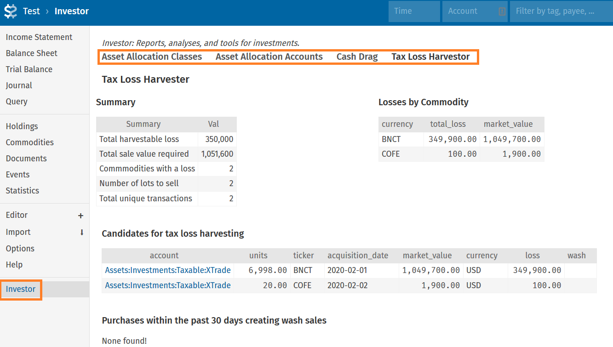
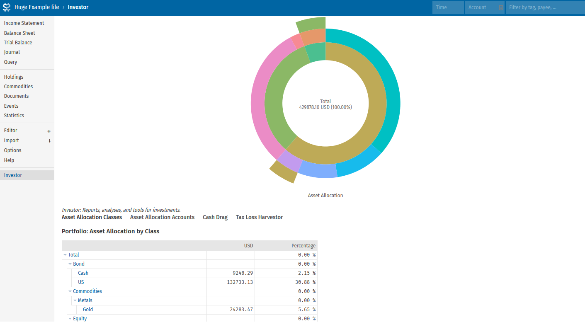

# Fava Investor

Fava Investor aims to be a comprehensive set of reports, analyses, and tools for
investments, for [Beancount](https://beancount.github.io/) and
[Fava](https://github.com/beancount/fava) (software for
[plain text, double entry bookkeeping](https://plaintextaccounting.org/)). It is developed as a
collection of modules, with each module offering a Fava plugin, a Beancount library, and
a shell command.

Interactivity and visualization are key for investing reports and tools, and hence the
primary focus is on Fava, even though all modules will have all three interfaces.

### Current modules:
- [Visual, tree structured asset allocation by class](https://github.com/redstreet/fava_investor/tree/main/fava_investor/modules/assetalloc_class#readme)
- Asset allocation by account
- [Tax loss harvestor](https://github.com/redstreet/fava_investor/tree/main/fava_investor/modules/tlh#readme)
- [Cash drag analysis](https://github.com/redstreet/fava_investor/tree/main/fava_investor/modules/cashdrag#readme)
- [Summarizer](https://github.com/redstreet/fava_investor/tree/main/fava_investor/modules/summarizer#readme)

### Demo
***Play with the live demo at
  [pythonanywhere](http://favainvestor.pythonanywhere.com/example-beancount-file/extension/Investor/)***.


#### Screenshots (dated):



### Utilities

Fava Investor ships with `ticker-util`, which is a collection of utilities for:
- downloading information from Yahoo for commodities (tickers), and annotating your
  commodity declarations with metadata
- discovering relationships between tickers in your Beancount file, such as equivalent
  and substantially similar tickers, and tax loss harvesting partner groups, from a
  minimal and incomplete specification
- providing ISIN an other ticker identifying information to your importers

For more, install fava_investor via pip, and then see:
```
ticker-util --help
ticker-util relate --help
```


## Installation via pip
```bash
pip3 install fava-investor
```

Or to install the bleeding edge version from git:
```bash
pip3 install git+https://github.com/redstreet/fava_investor
```
See [#55](https://github.com/redstreet/fava_investor/issues/55) for MacOS installation.

## Running Fava Investor
### Running in Fava:
Add this to your beancount source, and start up fava as usual:
```
2000-01-01 custom "fava-extension" "fava_investor" "{}"
```

You should now see an 'Investor' link in the sidebar in fava. For more on how to
configure the extension, see the included `huge-example.beancount`.

### Running on the Command-Line:
The command line interface (CLI) is accessed using the `investor` command, which has
subcommands for each module. Eg:

```
investor assetalloc-class
investor tlh
investor --help
```

Both the CLI and the utility (`ticker-util`) use [click](https://click.palletsprojects.com/en/8.1.x/).
[See here](https://click.palletsprojects.com/en/8.1.x/shell-completion/#enabling-completion)
to enable shell completion in zsh, bash, or fish, which is highly recommended.

## Problems?
- Monitor the terminal you are running fava from to look for error output from
  fava_investor
- Include the error messages you see above when opening bug reports or asking for help
